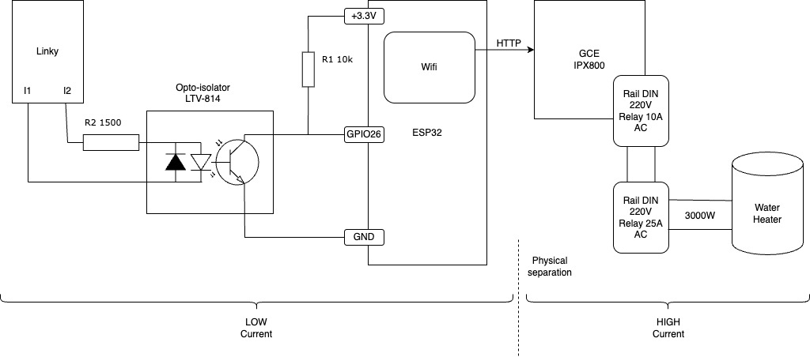

# esp32-solar-router
ESP32 Solar Router based on GCE IPX800

# Material 
* AZDelivery ESP32 NodeMCU Module WLAN WiFi Dev Kit C Development Board with CP2102
* Boîtes de Jonction, Boîtiers électroniques en Plastique Cas de Projet, Boîtier de Câblage, Boîte de Connexion de Câblage pour Électrique (Blanc, 100x60x25mm)
* Heschen Contacteur ca domestique, HS1-25, 2 pôles 1NO 1NC, CA 220V/240V tension de bobine, 35mm montage sur Rail DIN
* Coupleur optique LTV-814
* R1 : 10 kΩ, 1/4W ou 1/8W
* R2 : 1.5kΩ, 1/4W ou 1/8W
* GCE IPX800

# Schema

